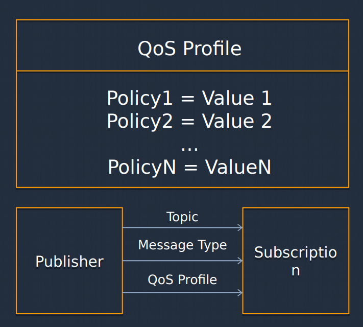
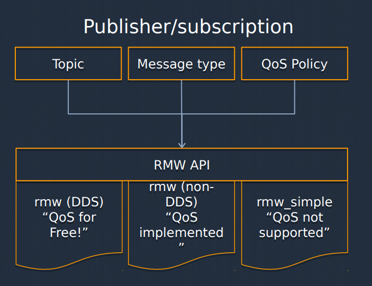
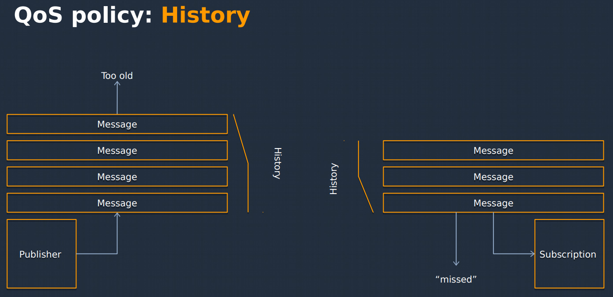
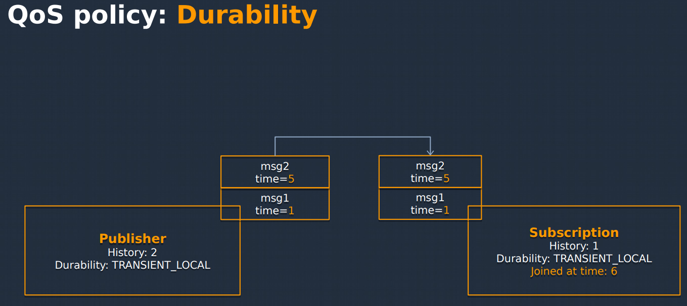
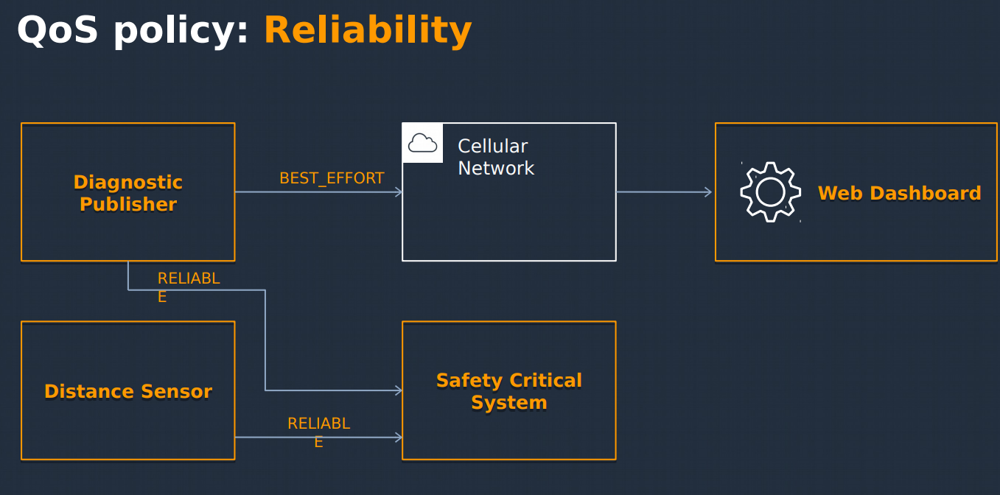
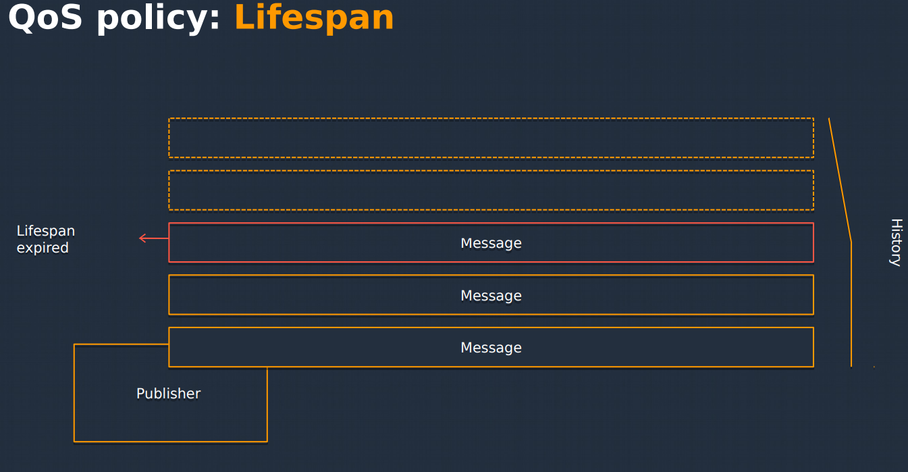
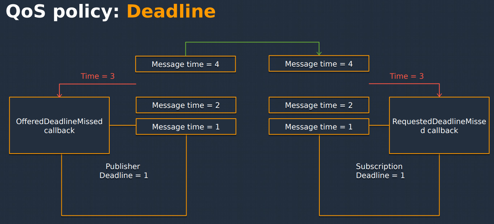
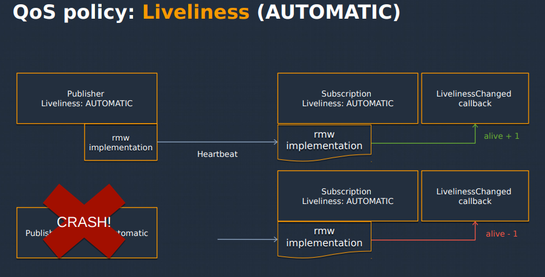
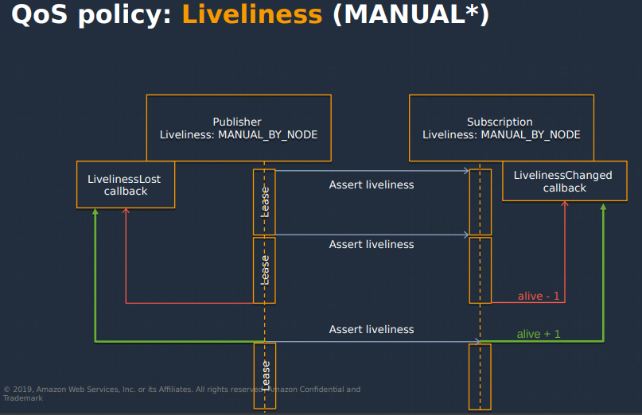

# ROS2 QOS

This repository demonstrates the usage of ROS2 quality of service (QoS). It is an advanced behavior of publish and subscribe (pub/sub) communications.



QoS is a DDS concepts which has been formalized into ROS2. Additionally, non-DDS RMWs can choose to provide QoS.

If QoS profile matches for both publisher and subscriber, the messages will start flowing in. Otherwise, there will be no message coming in as the system is unable to guarantee the QoS.



## Types of QoS Policies

- History: How many messages to keep locally? Similar to ROS1 "queue_size".
    - Legal Values:
        - `KEEP_ALL`:
        - `KEEP_LAST + depth`:
    - Compatibility: N/A - does not apply to matching.
    - Example: Image processing queue.
- Durability: Should publishers provide old messages? Similar to ROS1 "latching".
    - Legal Values:
        - `VOLATILE`: Late joining subscriptions receive nothing.
        - `TRANSIENT_LOCAL`: Publisher provide old messages.
    - Compatibility: `TRANSIENT_LOCAL` > `VOLATILE`
    - Example: Latest mission state machine.
- Reliability: Do messages have to be deliver/received?
    - Legal Values:
        - `BEST_EFFORT`: No delivery guarantee.
        - `RELIABLE`: Guarantee delivery*
    - Compatibility: `RELIABLE` > `BEST_EFFORT`
    - Example: Visualizer for human dosen't need retry; safety critical update must get through.
- Lifespan: How long before an un-sent/un-consume message is not useful anymore?
    - Legal Values:
        - `Duration`: duration.
    - Compatibility: Offered duration >= Requested duration
    - Example: Estimate pose when moving.
- Deadline: How often must I send messages? (minimum frequency). If it is being trigger both the subscriber and publisher will get an event callback.
    - Legal Values:
        - `Period`: duration.
    - Compatibility: Offered duration <= Requested duration
    - Callbacks:
        - Publisher - OfferedDeadlineMissed
        - Subscription - RequestedDeadlineMissed
    - Example: `/cmd_vel` safety watchdog.
- Liveliness: What type of heartbeat to I need to give to prove I'm not dead?
    - Legal Values:
        - Kind
            - `AUTOMATIC`
            - `MANUAL_BY_TOPIC`
            - `MANUAL_BY_NODE`
        - Lease Duration: duration
    - Compatibility
        - `MANUAL_BY_TOPIC` > `MANUAL_BY_NODE` > `AUTOMATIC`
        - Offered lease duration <= Requested lease Duration
    - Callbacks:
        - Publisher - LivelinessLost
        - Subscription - LivelinessChanged










## Examples

For Transient Local to work, both publisher and subscriber must be exactly the same, if not it will not work.

```bash
# For example
ros2 topic echo --qos-durability transient_local --qos-reliability reliable /tl_topic
```


## New Concepts

- Some QoS policies generate `events`.
- Subscription already had `message callback` and now there is a `QoS Event callback`.
- Publishers get them too!

## Reference
- [ros2_documentation_qos](https://docs.ros.org/en/foxy/Concepts/About-Quality-of-Service-Settings.html)
- [roscon_qos](https://vimeo.com/379127762)
- [design_principle_of_qos](http://design.ros2.org/articles/qos_configurability.html)
- [example_of_qos](https://surfertas.github.io/ros2/2019/08/17/ros2-qos.html) [example_of_qos2](https://hackmd.io/@st9540808/r1zrNKBWU/%2F%401IzBzEXXRsmj6-nLXZ9opw%2FBkaxoWRiI)
- [dds_and_qos](https://www.youtube.com/watch?v=WajZmurQYMc)